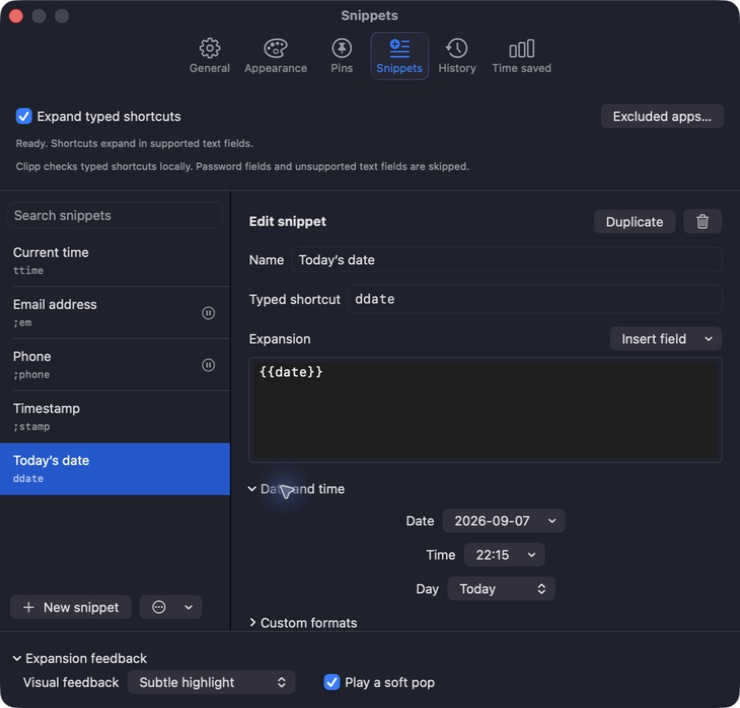

# Clipp

Clipboard history and text expansion for macOS. Find something you copied, paste it with a shortcut, or turn a short abbreviation into text you use often.

Clipp is free, open source, and based on [Maccy](https://github.com/p0deje/Maccy). It runs locally on **macOS Sonoma 14 or later**, with universal releases for Apple Silicon and Intel.



## Features

- **Clipboard history:** search text, images, and files; pin items you want to keep.
- **Quick selection:** `⌘1`–`⌘9` activates visible results. Plain numbers go into search.
- **Text expansion:** user-defined abbreviations, reusable snippets, and configurable date/time fields.
- **Time saved:** local activity counts and adjustable estimates, with a clear explanation of the assumptions.
- **Native controls:** keyboard navigation, image previews, optional expansion sound and visual feedback.
- **Local storage:** no account or cloud sync. Clipboard history, snippets, and statistics stay on your Mac.

## Install

Download `Clipp.dmg` or `Clipp.zip` from the [latest release](https://github.com/juanmaramos/clipp/releases/latest), then move `Clipp.app` to Applications and open it.

Or use the custom Homebrew tap:

```sh
brew tap juanmaramos/tap https://github.com/juanmaramos/clipp.git
brew install --cask juanmaramos/tap/clipp
```

The cask installs the same signed, notarized app as the release download and follows published releases.

### Updates

Use **Settings → General → Check now**, or enable **Check for updates automatically**. Release builds use Sparkle to install updates; you do not need to visit GitHub for each version.

To update through Homebrew:

```sh
brew update
brew upgrade --cask --greedy juanmaramos/tap/clipp
```

`--greedy` includes apps that have their own updater. Older builds with an outdated update feed can be replaced with the latest download from GitHub Releases.

## Use clipboard history

1. Press **⇧⌘C** to open the picker. This is the default; existing custom shortcuts are preserved.
2. Type to search, then use the arrow keys and Return, or press **⌘1–⌘9** to activate a visible result.
3. New installations paste the selected item as plain text. Change this in **Settings → General → When selecting an item** and **Text formatting**.

Allow Clipp in **System Settings → Privacy & Security → Accessibility** for automatic pasting. Without that permission, selected items are copied for you to paste with **⌘V**.

| Action | Default shortcut |
| --- | --- |
| Open clipboard history | ⇧⌘C |
| Activate visible result 1–9 | ⌘1–⌘9 |
| Navigate / search | ↑ ↓ / start typing |
| Activate selected result | Return |
| Copy selected result | ⌥Return |
| Pin / unpin item | ⌥P |
| Delete item | ⌥⌫ |
| Clear unpinned history | ⌥⌘⌫ |
| Clear history including pins | ⇧⌥⌘⌫ |
| Open settings | ⌘, |
| Close picker | Esc |

Change the picker shortcut in **Settings → General → Open clipboard history**. Clearing clipboard history keeps the snippet library.

## Snippets and typed shortcuts

Open **Settings → Snippets**. Create a snippet, or choose **Add examples…** from the library’s More menu.

| Example | Expansion |
| --- | --- |
| `ddate` followed by Space | Today’s date, with the Space preserved |
| `ttime` followed by Space | Current time |
| `;stamp` | Current date and time, expanded immediately |
| `;em` | Your email address after you edit and enable the example |
| `;phone` | Your phone number after you edit and enable the example |

Choose your own abbreviation and whether it expands immediately or after Space. Configure date and time presets, relative days, or custom formats, locale, and time zone. Supported fields are `{{date}}`, `{{time}}`, `{{datetime}}`, and `{{clipboard}}`; clipboard text is inserted literally, never evaluated as a script.

Turn on **Expand typed shortcuts** and allow Accessibility. Grant **Input Monitoring** only if Clipp’s status asks for it. Password fields, secure input, excluded apps, input-method composition, and unsupported text fields are skipped.

Use **Try this shortcut** to preview a draft inside settings. Use the picker’s **Snippets** filter to insert a snippet manually, including one whose automatic shortcut is disabled. Personal example placeholders start disabled.

Typed expansion preserves the previous clipboard unless something newer is copied during insertion. **Expansion feedback** offers a subtle highlight, a badge, or no visual feedback, plus an optional soft pop. Undo behavior and text-field support depend on the destination app.

## Time saved

Open **Settings → Time saved** for clipboard reuses, confirmed typed expansions, characters avoided, and estimated savings for today, 7 days, 30 days, or all recorded time.

The defaults are **50 words/minute** and an assumed **5 seconds per clipboard reuse**. Both are adjustable in **How we calculate this**; set clipboard seconds to 0 to exclude that estimate. These are estimates of effort avoided, not measured productivity or comparisons with other users.

Only daily counts are stored, starting with this version. Statistics contain no clipboard text, app names, or typing history, and can be paused or reset. [Read the formulas, sources, and limitations](METRICS.md).

## Capture and privacy settings

In **Settings → History**, choose what to save, history size, and sorting. **Pause clipboard history** and **Skip the next copy** are separate controls. Open **Excluded apps and rules…** to configure application and text exclusions.

Use **Settings → Snippets → Excluded apps…** for additional expansion exclusions. Clipboard application exclusions also apply to automatic expansion.

Pinned items stay until you unpin or remove them, or explicitly clear history including pins. Snippets are stored separately and survive clearing clipboard history.

## Build from source

```sh
git clone https://github.com/juanmaramos/clipp.git
cd clipp
open Maccy.xcodeproj
```

Select the **Clipp** scheme in Xcode and build. CI uses the latest stable Xcode. Debug builds use a separate `futurialabs.clipp.dev` identity, data, and preferences, and do not install public updates.

Run the unit and regression tests:

```sh
xcodebuild -project Maccy.xcodeproj -scheme Clipp -configuration Debug \
  -derivedDataPath /tmp/clipp-development -destination 'platform=macOS' \
  CODE_SIGN_IDENTITY=- CODE_SIGN_STYLE=Manual DEVELOPMENT_TEAM= \
  -only-testing:MaccyTests test
```

## Releases

Pull requests and pushes to main run tests and a universal Release build. The separate **Publish release** workflow runs regression tests, signs with Developer ID and hardened runtime, notarizes and staples the app, and publishes ZIP/DMG packages with checksums. It also signs the Sparkle update and updates the appcast and Homebrew cask from that exact ZIP. See [DISTRIBUTION.md](DISTRIBUTION.md).

## Credits and support

Clipp is a fork of [Maccy](https://github.com/p0deje/Maccy), released under the [MIT license](LICENSE).

If Clipp is useful to you, you can [support development](https://buymeacoffee.com/jmramos86k).
